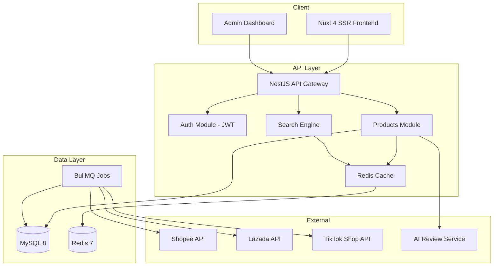
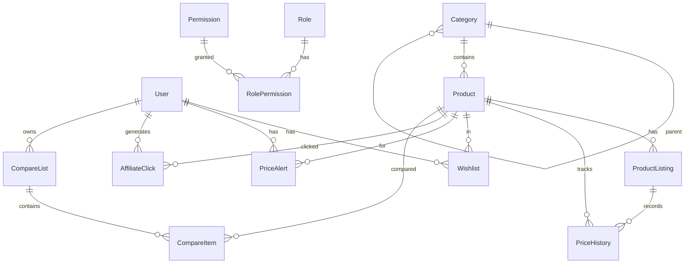
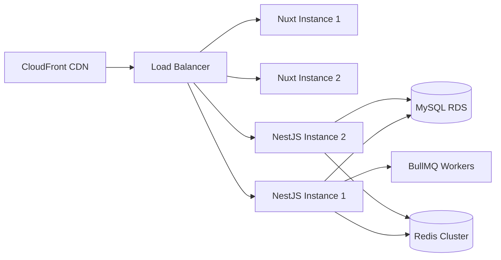

# DealHub TH - System Architecture

## 1. System Overview



## 2. ER Diagram



## 3. Clean Architecture Layers

```
┌─────────────────────────────────────────┐
│           Presentation Layer            │
│  Controllers, DTOs, Guards, Swagger     │
├─────────────────────────────────────────┤
│           Application Layer             │
│  Services, Use Cases, CQRS Handlers     │
├─────────────────────────────────────────┤
│             Domain Layer                │
│  Entities, Value Objects, Interfaces    │
├─────────────────────────────────────────┤
│          Infrastructure Layer           │
│  Prisma, Redis, BullMQ, External APIs   │
└─────────────────────────────────────────┘
```

## 4. API Specification

Base URL: `http://localhost:3001/api/v1`

| Method | Endpoint | Auth | Description |
|--------|----------|------|-------------|
| POST | /auth/register | Public | สมัครสมาชิก |
| POST | /auth/login | Public | เข้าสู่ระบบ |
| POST | /auth/refresh | Public | รีเฟรชโทเค็น |
| GET | /products/search | Public | ค้นหาสินค้า |
| GET | /products/trending | Public | สินค้ามาแรง |
| GET | /products/top-selling | Public | สินค้าขายดี |
| GET | /products/compare | Public | เปรียบเทียบสินค้า |
| GET | /products/:slug | Public | รายละเอียดสินค้า |
| GET | /products/price-history/:id | Public | ประวัติราคา |
| GET | /categories | Public | หมวดหมู่ทั้งหมด |
| GET | /categories/:slug | Public | หมวดหมู่ตาม slug |
| GET | /wishlist | JWT | รายการโปรด |
| POST | /wishlist | JWT | เพิ่มรายการโปรด |
| DELETE | /wishlist/:productId | JWT | ลบรายการโปรด |
| GET | /price-alerts | JWT | แจ้งเตือนราคา |
| POST | /price-alerts | JWT | ตั้งแจ้งเตือน |
| DELETE | /price-alerts/:id | JWT | ยกเลิกแจ้งเตือน |
| POST | /affiliate/click | Public | บันทึก affiliate click |
| GET | /affiliate/stats | Admin | สถิติ clicks |
| GET | /ai-reviews/:productId | Public | สรุปรีวิว AI |
| GET | /admin/dashboard | Admin | แดชบอร์ด |
| GET | /admin/users | Admin | รายการผู้ใช้ |

OpenAPI Docs: http://localhost:3001/api/docs

## 5. Authentication Design

```
┌──────────┐    Login     ┌──────────┐
│  Client  │─────────────>│  Auth    │
│          │<─────────────│  Service │
└──────────┘  JWT Tokens  └──────────┘
     │                          │
     │  Access Token (15min)    │
     │  Refresh Token (7days)   │
     ▼                          ▼
┌──────────┐              ┌──────────┐
│  API     │              │  MySQL   │
│  Guards  │              │  Users   │
└──────────┘              └──────────┘

RBAC Roles:
- USER: ค้นหา, wishlist, price alerts
- ADMIN: จัดการสินค้า, ดูสถิติ
- SUPER_ADMIN: จัดการผู้ใช้, ระบบทั้งหมด
```

## 6. SEO Strategy

- **SSR**: Nuxt 4 server-side rendering สำหรับทุกหน้าสาธารณะ
- **Meta Tags**: `useSeoMeta()` ทุกหน้า พร้อม Open Graph
- **Structured Data**: JSON-LD สำหรับ Product schema
- **Sitemap**: Auto-generated `/sitemap.xml`
- **Canonical URLs**: ป้องกัน duplicate content
- **Thai Language**: `lang="th"` + Noto Sans Thai font
- **Image Optimization**: Lazy loading + alt tags

## 7. Scaling Strategy (1M Products)

| Component | Strategy |
|-----------|----------|
| Database | MySQL read replicas, table partitioning by category |
| Search | Elasticsearch/Meilisearch for full-text search |
| Cache | Redis cluster, CDN for static assets |
| API | Horizontal scaling with load balancer |
| Queue | BullMQ workers for price sync jobs |
| Images | S3/CloudFront CDN |

### Database Indexing
- Fulltext index on `products.name`, `search_keywords`
- Composite indexes on `product_listings(marketplace, price)`
- Partition `price_history` by month

## 8. Deployment Architecture



## 9. Security Checklist

- [x] JWT Authentication with refresh tokens
- [x] Password hashing (bcrypt, cost 12)
- [x] RBAC (Role-Based Access Control)
- [x] Rate limiting (ThrottlerGuard, 100 req/min)
- [x] Input validation (class-validator)
- [x] CORS configuration
- [x] SQL injection prevention (Prisma ORM)
- [x] XSS prevention (Vue auto-escaping)
- [ ] HTTPS/TLS in production
- [ ] Helmet security headers
- [ ] CSRF protection
- [ ] API key rotation
- [ ] Audit logging
- [ ] DDoS protection (CloudFlare)

## 10. Event Driven Architecture

```
ProductPriceUpdated → PriceHistoryRecorded
                    → CacheInvalidated
                    → PriceAlertChecked

AffiliateClickRecorded → AnalyticsUpdated

UserRegistered → WelcomeEmailSent
```

Events handled via `@nestjs/event-emitter` with BullMQ for async processing.
